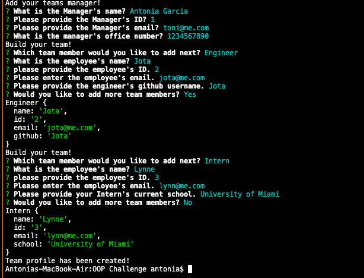
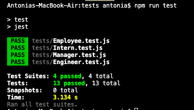

# Team Generator

## Description
This application creates a web page that displays each team members information, allowing them to quickly and easily find ways to reach each other when needed. Before creating, the application will ask for team members information, so it can build each card for the webpage. It is easy to use just save the repo and get started!

<details>
<summary>Table of Contents</summary>
    <ul>
        <li>
            <a href="#description">Description</a>
        </li>
        <li>
            <a href="#built-with">Built With</a>
        </li>
        <li>
            <a href="#usage">Usage</a>
        </li>
    </ul>
</details>

## Built With

This application was built using:

* [Node.js](https://nodejs.org/en/)
* [JQuery](https://jqueryui.com/)
* [Bootstrap](https://getbootstrap.com/docs/5.1/utilities/spacing/)
* [Inquirer](https://www.npmjs.com/package/inquirer)
* [Jest](https://www.npmjs.com/package/jest)

## Usage 

To use this application, you must download the files from the repository and have the ``Built with`` programs installed.

Once everything is installed, using the index.js file, in the terminal you will run it using node:
```
node index.js
```

Follow the prompts 



Once finished, the html page will be located in the ``dist`` folder along with the CSS file.

If any issues arise, there is a tests folder that contains tests for each employee class.



[Here](https://watch.screencastify.com/v/yEixDr2Eh9qH6AJCK5Oo) is a video showing how to use the application, and how to run tests provided.

## License


## Contact

Antonia Garcia - antoniag227@gmail.com

## Acknowledgements

* [GitHub Pages](https://pages.github.com)
* [Font Awesome](https://fontawesome.com)